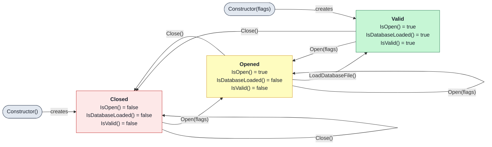

<p align="center">
  <h1 align="center">✨ Libmagicxx ✨</h1>
  <p align="center">
    <strong>A Modern C++23 Wrapper for libmagic</strong>
  </p>
  <p align="center">
    <em>Bringing the power of the Unix <code>file</code> command to modern C++</em>
  </p>
</p>

<p align="center">
  <a href="https://github.com/oguztoraman/libmagicxx/releases/latest">
    
  </a>
  <a href="https://www.gnu.org/licenses/lgpl-3.0">
    
  </a>
  <a href="https://en.cppreference.com/w/cpp/23">
    
  </a>
  <a href="https://github.com/oguztoraman/libmagicxx/releases/latest">
    
  </a>
</p>

<p align="center">
  <a href="https://github.com/oguztoraman/libmagicxx/actions/workflows/build_and_test_linux_gcc.yml">
    
  </a>
  <a href="https://github.com/oguztoraman/libmagicxx/actions/workflows/build_and_test_linux_clang.yml">
    
  </a>
  <a href="https://github.com/oguztoraman/libmagicxx/actions/workflows/build_windows_mingw64.yml">
    
  </a>
  <a href="https://github.com/oguztoraman/libmagicxx/actions/workflows/build_windows_clang.yml">
    
  </a>
  <a href="https://github.com/oguztoraman/libmagicxx/actions/workflows/check_clang_tidy.yml">
    
  </a>
</p>

<p align="center">
  <a href="https://app.codacy.com/gh/oguztoraman/libmagicxx/dashboard">
    
  </a>
  <a href="https://sonarcloud.io/summary/new_code?id=oguztoraman_libmagicxx">
    
  </a>
</p>

---

**Libmagicxx** is a modern C++23 wrapper library for the battle-tested [libmagic](https://github.com/file/file) — the same library that powers the Unix `file` command used by millions of developers worldwide. Rather than reinventing the wheel, libmagicxx brings libmagic's decades of file type detection expertise into the modern C++ ecosystem with an elegant, type-safe interface.

### What libmagicxx adds to libmagic:

| libmagic (C API) | libmagicxx (C++23 Wrapper) |
|------------------|----------------------------|
| Manual resource management | RAII with automatic cleanup |
| Error codes and global state | `std::expected` and exceptions |
| Raw C strings | `std::string` and `std::string_view` |
| Procedural API | Object-oriented `Magic` class |
| No type safety | Strong typing with concepts |
| Manual flag handling | Type-safe `Flags` and `Parameters` enums |
| Single file identification | Batch directory and container identification |
| No progress feedback | Built-in progress tracking for batch operations |
| Manual state checking | `IsOpen()`, `IsDatabaseLoaded()`, `IsValid()` queries |
| One parameter at a time | Bulk `GetParameters()` / `SetParameters()` |

> 🔍 **Why a wrapper?** libmagic is the gold standard for content-based file detection, maintained for decades and used in countless production systems. Libmagicxx doesn't replace it—it makes it accessible to modern C++ developers with the safety and ergonomics they expect.

---

## 📋 Table of Contents

- [Why Use Libmagicxx?](#-why-use-libmagicxx)
- [What Libmagicxx Adds](#-what-libmagicxx-adds)
- [Supported Platforms](#-supported-platforms)
- [Quick Start](#-quick-start)
- [Installation](#-installation)
- [Usage with CMake](#-usage-with-cmake)
- [Magic States](#-magic-states)
- [CMake Package Variables](#-cmake-package-variables)
- [Examples](#-examples)
- [Documentation](#-documentation)
- [Contributing](#-contributing)
- [Security](#-security)
- [License](#-license)
- [Disclaimer](#-disclaimer)

---

## 🎯 Why Use Libmagicxx?

**You need libmagic's capabilities, but want modern C++:**

| Your Need | Libmagicxx Solution |
|-----------|----------|
| 🔒 **Security** | Use libmagic's proven detection to validate file uploads |
| 🎨 **Media Processing** | Route files to correct handlers based on true content type |
| 📁 **File Management** | Leverage decades of magic database refinements |
| ⚡ **Developer Experience** | Write idiomatic C++23 instead of C-style code |
| 🛡️ **Safety** | Automatic resource management prevents leaks and errors |

---

## ✨ What Libmagicxx Adds

### 🚀 Modern C++23 Interface

Wraps libmagic's C API with modern features:
- `std::expected` for elegant error handling
- Concepts and constraints for type safety
- RAII for automatic resource management

### 🎯 High-Level API

Clean, intuitive interface:
```cpp
Magic magic{Magic::Flags::Mime};
auto type = magic.IdentifyFile("document.pdf");
// Returns: "application/pdf"
```

### 📦 CMake Integration

First-class CMake support:
```cmake
find_package(Magicxx REQUIRED)
target_link_libraries(app Recognition::Magicxx)
```

### 🌍 Cross-Platform

- ✅ Linux (x86_64) — GCC & Clang
- ✅ Windows (x86_64) — MinGW & Clang
- 📦 DEB, RPM, and NSIS installers

### Why Use the Wrapper?

- 📚 **libmagic Power** — Access libmagic features through a clean C++ interface
- 🛡️ **Memory Safe** — No manual `magic_open`/`magic_close` calls to forget
- 🧪 **Extensively Tested** — 600+ unit tests (shared and static libs tested independently)
- 🔧 **Flexible Configuration** — All 30 libmagic flags exposed as type-safe enums
- 📊 **Progress Tracking** — Shared progress tracker for monitoring batch operations
- 🗃️ **Database Support** — Easy loading of custom magic definition files

---

## �� Supported Platforms

| Platform | Architecture | Compilers | Package Formats |
|----------|--------------|-----------|-----------------|
| 🐧 **Linux** | x86_64 | GCC, Clang | `.deb`, `.rpm` |
| 🪟 **Windows** | x86_64 | MinGW-w64, Clang | `.exe` (NSIS) |

---

## 🚀 Quick Start

Get up and running in under a minute:

```bash
# 1. Download the latest release for your platform
#    → https://github.com/oguztoraman/libmagicxx/releases/latest

# 2. Install (Linux example)
sudo apt install ./libmagicxx-*-linux-x86_64.deb   # Debian/Ubuntu
sudo dnf install ./libmagicxx-*-linux-x86_64.rpm   # Fedora/RHEL

# 3. Use in your project (see CMake integration below)
```

---

## 📥 Installation

<details>
<summary><b>🐧 Debian/Ubuntu (APT)</b></summary>

```bash
sudo apt install ./libmagicxx-<version>-linux-x86_64.deb
```

</details>

<details>
<summary><b>🐧 Fedora/RHEL (DNF)</b></summary>

```bash
sudo dnf install ./libmagicxx-<version>-linux-x86_64.rpm
```

</details>

<details>
<summary><b>🪟 Windows (NSIS Installer)</b></summary>

1. Download `libmagicxx-<version>-windows-x86_64.exe`
2. Run the installer
3. Follow the on-screen instructions
4. Add the installation directory to your `PATH` if needed

</details>

<details>
<summary><b>🔧 Build from Source</b></summary>

```bash
git clone https://github.com/oguztoraman/libmagicxx.git
cd libmagicxx
python ./scripts/launch_container.py      # Pulls pre-built container from GHCR
./scripts/initialize.sh
./scripts/workflows.sh -p linux-x86_64-clang -c
```

To build the container locally instead: `python ./scripts/launch_container.py --local`

See <a href="CONTRIBUTING.md">CONTRIBUTING.md</a> for detailed build instructions.

</details>

📦 **Download:** [Latest Release](https://github.com/oguztoraman/libmagicxx/releases/latest) | [All Releases](https://github.com/oguztoraman/libmagicxx/releases)

---

## 🔧 Usage with CMake

### Step 1: Link the Library

Add to your `CMakeLists.txt`:

```cmake
find_package(Magicxx REQUIRED)

target_link_libraries(your_project
    PRIVATE Recognition::Magicxx        # Shared library
    # or
    PRIVATE Recognition::MagicxxStatic  # Static library
)
```

### Step 2: Identify Files

```cpp
#include <print>
#include <iostream>
#include <magic.hpp>

int main()
{
    using namespace Recognition;

    // Create a Magic instance with MIME type detection
    Magic magic{Magic::Flags::Mime};

    // Identify a file's type
    auto result = magic.IdentifyFile("mystery_file");
    std::println(std::cout, "File type: {}", result);
    // Example output: "application/pdf; charset=binary"
}
```

### Step 3: Advanced Usage

```cpp
#include <magic.hpp>
#include <future>
#include <thread>

using namespace Recognition;
using namespace std::chrono_literals;

// Combine multiple flags for detailed output
Magic detailed{
    Magic::Flags::MimeType |
    Magic::Flags::MimeEncoding |
    Magic::Flags::ContinueSearch
};

// Use custom database
Magic custom{Magic::Flags::None};
custom.LoadDatabaseFile("/path/to/custom.mgc");

// Track progress for batch file identification
Magic magic{Magic::Flags::Mime};
auto tracker = Utility::MakeSharedProgressTracker();

// Start identification in background thread
auto future = std::async([&magic, tracker] {
    return magic.IdentifyFiles("/large/directory", tracker);
});

// Monitor progress in main thread
while (!tracker->IsCompleted()) {
    std::println("Progress: {}", tracker->GetCompletionPercentage().ToString());
    std::this_thread::sleep_for(100ms);
}

auto results = future.get();
```

---

## 🔄 Magic States

The `Magic` class follows a clear state machine model:



| State | `IsOpen()` | `IsDatabaseLoaded()` | `IsValid()` | Can Identify Files? |
|-------|-------------|------------------------|--------------|---------------------|
| **Closed** | ❌ `false` | ❌ `false` | ❌ `false` | ❌ No |
| **Opened** | ✅ `true` | ❌ `false` | ❌ `false` | ❌ No |
| **Valid** | ✅ `true` | ✅ `true` | ✅ `true` | ✅ Yes |

> 💡 **Tip:** Use the convenience constructors—they automatically open and load the default database, putting you directly in the Valid state!

---

## 📊 CMake Package Variables

After `find_package(Magicxx)`, these variables are available:

| Variable | Description |
|----------|-------------|
| `MAGICXX_FOUND` | ✅ `TRUE` if Libmagicxx was found |
| `MAGICXX_VERSION` | Version string (e.g., `"9.1.1"`) |
| `MAGICXX_SHARED_LIB_AVAILABLE` | Shared library availability |
| `MAGICXX_STATIC_LIB_AVAILABLE` | Static library availability |
| `MAGICXX_INCLUDE_DIR` | Path to headers |
| `MAGICXX_LIB_DIR` | Path to libraries |
| `MAGICXX_LICENSE_DIR` | Path to license files |
| `MAGICXX_DOC_DIR` | Path to documentation |
| `MAGICXX_CMAKE_DIR` | Path to CMake config |
| `MAGICXX_DEFAULT_DATABASE_DIR` | Path to magic database |

---

## 📚 Examples

Explore real-world usage patterns in the <a href="examples/magic_examples.cpp">examples</a>:

| Example | Description |
|---------|-------------|
| Basic Identify | File identification with exception handling |
| Noexcept Identify | Non-throwing API with `std::expected` |
| Directory Identify | Batch identification of files in a directory |
| Custom Flags/Parameters | Configuring flags and tuning parameters |
| Check and Compile | Database validation and compilation |
| Progress Tracking | Monitoring batch operations with progress tracker |
| Container Identify | Identify specific files from a container |
| Lifecycle Management | Manual state transitions and queries |
| Version and All Parameters | Get version and bulk parameter operations |

---

## 📖 Documentation

<p align="center">
  <a href="https://oguztoraman.github.io/libmagicxx/">
    
  </a>
</p>

The comprehensive documentation includes:

| Section | Description |
|---------|-------------|
| **Modules** | Core API, Exceptions, Utility, String Conversions |
| **Classes** | `Magic`, `MagicException`, `Percentage`, `ProgressTracker` |
| **Examples** | 9 runnable examples with detailed explanations |
| **Style Guides** | C++ and CMake coding conventions |
| **Project Docs** | Contributing, Security, Code of Conduct, Changelog |

---

## 🤝 Contributing

We welcome contributions of all kinds! Whether you're fixing bugs, adding features, improving documentation, or suggesting enhancements—your help makes Libmagicxx better for everyone.

<p align="center">
  <a href="CONTRIBUTING.md">
    
  </a>
</p>

---

## 🔒 Security

Found a security vulnerability? Please report it responsibly.

<p align="center">
  <a href="SECURITY.md">
    
  </a>
</p>

---

## 📃 License

Libmagicxx is licensed under the **GNU Lesser General Public License v3.0**.

This means you can:
- ✅ Use it in commercial projects
- ✅ Link to it from proprietary software
- ✅ Modify and distribute it (under LGPL terms)

See <a href="COPYING.LESSER">COPYING.LESSER</a> for the full license text.

<details>
<summary><b>Third-Party Licenses</b></summary>

| Component | License |
|-----------|---------|
| [file/libmagic](https://github.com/file/file) | [BSD-2-Clause](https://github.com/file/file/blob/master/COPYING) |
| [GoogleTest](https://github.com/google/googletest) | [BSD-3-Clause](https://github.com/google/googletest/blob/main/LICENSE) |
| [libgnurx](https://github.com/TimothyGu/libgnurx) | [LGPL-2.1-or-later](https://github.com/TimothyGu/libgnurx/blob/master/COPYING.LIB) |

</details>

---

## 📜 Disclaimer

This project is a personal hobby project developed independently. It is not affiliated with, endorsed by, or created on behalf of any employer, company, or organization. No proprietary or confidential information was used in its development.

---

<p align="center">
  <sub>Made with ❤️ for the C++ community</sub>
</p>

<p align="center">
  <a href="https://github.com/oguztoraman/libmagicxx">
    
  </a>
</p>
